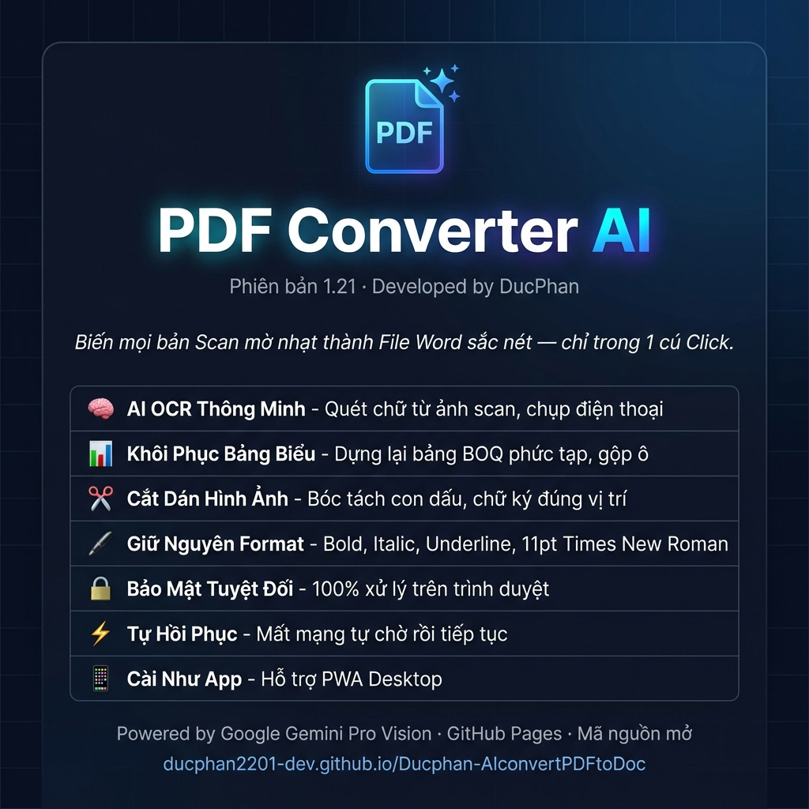

# 📄 PDF Converter AI
### **Phiên bản 1.21** · *Developed by DucPhan*

> *Biến mọi bản Scan mờ nhạt thành File Word sắc nét — chỉ trong 1 cú Click.*

### 🔗 [**Dùng ngay →**](https://ducphan2201-dev.github.io/Ducphan-AIconvertPDFtoDoc/)

---

## ✨ Tính năng chính

| | Tính năng | Mô tả |
|:---:|:---|:---|
| 🧠 | **AI OCR Thông Minh** | Quét chữ từ ảnh scan, chụp điện thoại, photocopy mờ |
| 📊 | **Khôi Phục Bảng Biểu** | Dựng lại bảng BOQ phức tạp, hỗ trợ gộp ô colspan/rowspan |
| ✂️ | **Cắt Dán Hình Ảnh** | Tự động bóc tách con dấu, chữ ký, sơ đồ đúng vị trí gốc |
| 🖋️ | **Giữ Nguyên Format** | Bold, Italic, Underline, căn lề — chuẩn 11pt Times New Roman |
| 🔒 | **Bảo Mật Tuyệt Đối** | 100% xử lý trên trình duyệt, không upload file lên server nào |
| ⚡ | **Tự Hồi Phục** | Mất mạng giữa chừng? Tự chờ rồi tiếp tục, không mất dữ liệu |
| 📱 | **Cài Như App** | Hỗ trợ PWA — thêm vào màn hình chính như phần mềm Desktop |

## 🚀 Cách sử dụng

1. Truy cập **[PDF Converter AI](https://ducphan2201-dev.github.io/Ducphan-AIconvertPDFtoDoc/)**
2. Nhập **Google Gemini API Key** (lấy miễn phí tại [aistudio.google.com](https://aistudio.google.com/apikey))
3. Kéo thả file **PDF** vào ứng dụng
4. Chờ AI xử lý → Tải file **Word (.docx)** về máy

## 🛠️ Công nghệ

- **AI Engine:** Google Gemini Pro Vision
- **PDF Rendering:** PDF.js
- **DOCX Generator:** docx.js
- **Hosting:** GitHub Pages (Miễn phí · Vĩnh viễn)

## 📱 Cài đặt PWA

<b>💻 Máy tính (Chrome)</b>

1. Mở link ứng dụng trên Chrome
2. Bấm icon **⊕** trên thanh địa chỉ → **Cài đặt**
3. App xuất hiện trên Desktop!

<b>📱 Android (Chrome)</b>

1. Mở link trên Chrome → Bấm **⋮** (3 chấm)
2. Chọn **"Thêm vào Màn hình chính"**

<b>🍎 iPhone (Safari)</b>

1. Mở link trên Safari → Bấm icon **⬆️ Chia sẻ**
2. Chọn **"Thêm vào MH chính"**

---

**© 2026 DucPhan** · Mã nguồn mở

